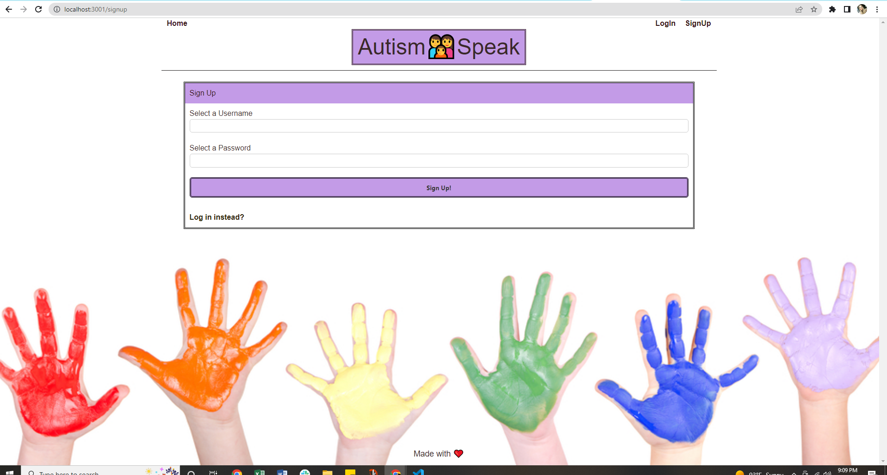
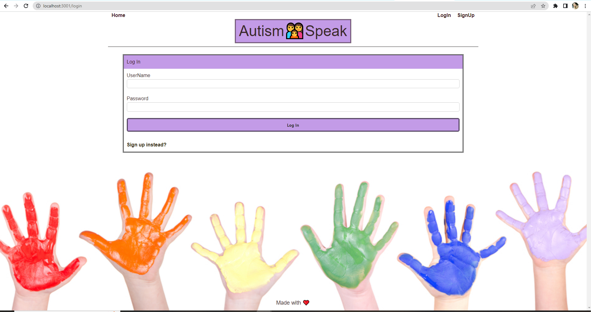
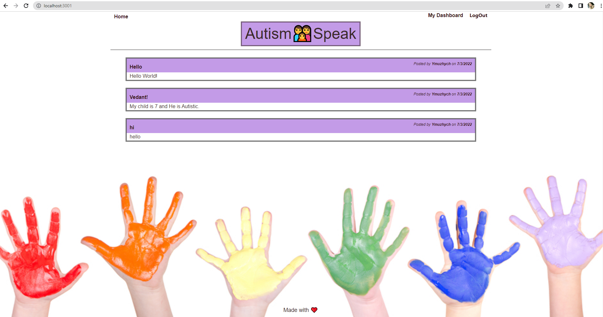
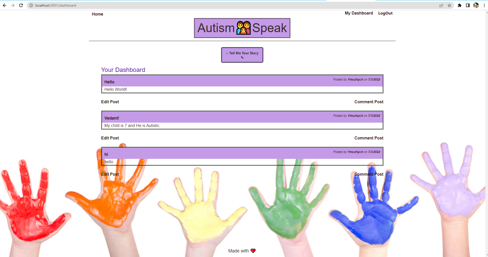
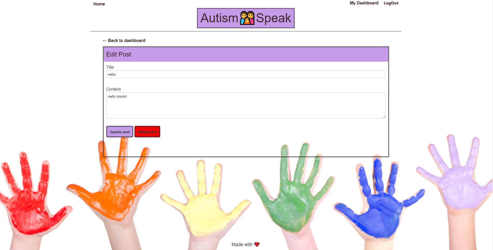
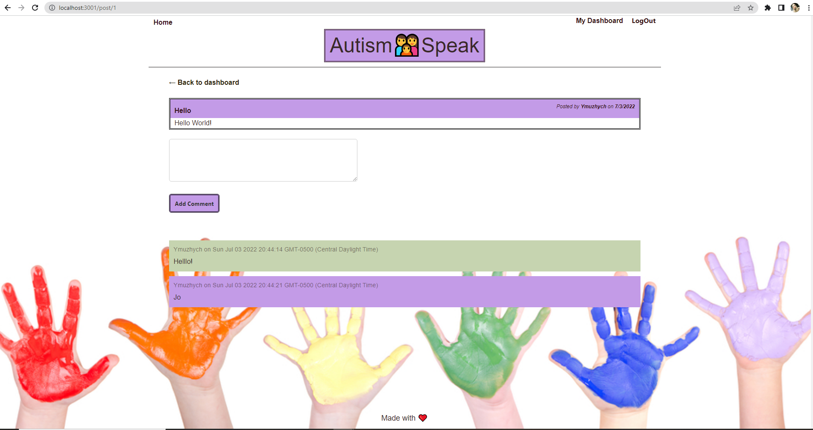

# Autism_Speak

## Description
A forum for parents or really any family of ASD children to discuss anything related to ASD. Whether seeking advice, looking for suggestions, needing to vent, or simply just wanting someone in the same situation to talk too. Autism speaks is the community to join.

- When a user visits webpage they can either sign up or log back in if they made an account.

- When a user makes a post it will be visible to all users.

- When a user clicks on a post title or button Comment Post they will be able to comment.

- When a user clicks edit they can edit their own posts.

- When a user clicks delete they can delete their own posts.

## Screenshot

- Sign Up





- LogIn





- Home Page





- Dashboard




- Edit & Comment





## User story
Did you know that the number of children with Autism Spectrum Disorder (ASD) is increasing dramatically fast? It’s to the point that in places like Austin, there are not enough schools to place all the kids. There are people who learn how to treat their children through someone else’s stories (and through therapists of course). So, what if there was a forum dedicated to the parents of ASD children to post stories and get advice from people in the same situation as them?

### Acceptance Criteria
* Use Node.js and Express.js to create a RESTful API.

* Use Handlebars.js as the templating engine.

* Use MySQL and the Sequelize ORM for the database.

* Have both GET and POST routes for retrieving and adding new data.

* Be deployed using Heroku (with data).

* Use at least one new library, package, or technology that we haven’t discussed.

* Have a polished UI.

* Be responsive.

* Be interactive (i.e., accept and respond to user input).

* Have a folder structure that meets the MVC paradigm.

* Include authentication (express-session and cookies).

* Protect API keys and sensitive information with environment variables.

* Have a clean repository that meets quality coding standards (file structure, naming conventions, best practices for class/id naming conventions, indentation, quality comments, etc.).

* Have a quality README (with unique name, description, technologies used, screenshot, and link to deployed application).

## Additional description about the project and its Development

- Add a .env file to the root of the app with the following details

```text
DB_NAME = 'blog_db'
DB_USER = 'root'
DB_PW = '******'
DB_SECRET = '******'
// JAWSDB_URL = '';

```

## Built With:
- CSS
- JAVASCRIPT
- HANDLEBARS
- SQL
- MULTER
- NODE.JS
- EXPRESS
- Bulma

## Links:
Presentation:
https://docs.google.com/presentation/d/1fKuNVQmavW5b9uAvE2g2nCfL4kQMVG5xw8Cxx0UD8Qc/edit?usp=sharing

Deployed:

Repo:

Heroku:


## Contributors:
* Yuliia Muzhychenko

* JaNessa McDonald

* Zachary Scism

* Safiya Simmonds